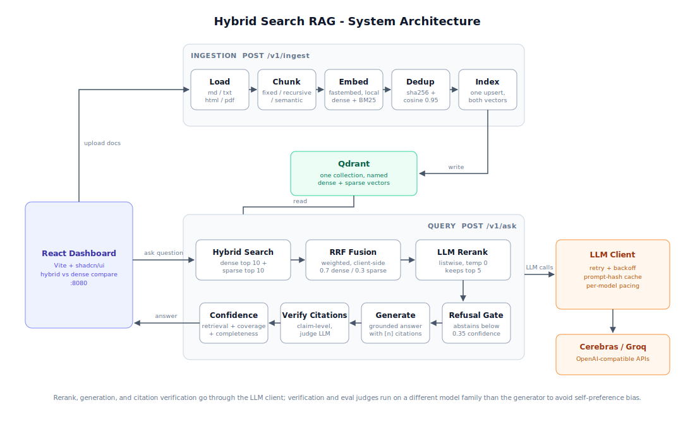

# Hybrid RAG over Internal Docs

A production-grade Retrieval-Augmented Generation system that ingests internal
documentation, indexes it with **both dense vector and sparse BM25 search**,
retrieves the most relevant context with **Reciprocal Rank Fusion + LLM
reranking**, and generates **grounded answers with verified inline citations** -
plus a confidence score and a graceful "I don't know" when the evidence is thin.

## Highlights

- **Hybrid retrieval**: dense (fastembed `bge-small-en-v1.5`) + sparse (BM25) in a
  single Qdrant collection, fused with configurable-weight RRF, then reranked
  listwise by an LLM.
- **Grounded, verified answers**: every claim cites `[n]` sources; a judge LLM
  verifies each citation actually supports its claim (always on).
- **Confidence scoring**: retrieval quality, citation coverage, and completeness ->
  a composite score; low retrieval confidence triggers a structured "I don't know".
- **Three chunking strategies** (fixed / recursive / semantic) that can be
  compared head-to-head by the eval harness.
- **Eval-first**: a hand-curated golden Q&A set drives automated metrics
  (correctness, faithfulness, retrieval hit, citation accuracy) - no manual poking.
- **Dashboard**: ask questions, see clickable citations, ranked retrieved chunks,
  confidence breakdown, and a hybrid-vs-dense side-by-side toggle.

## Architecture



The backend module map lives in [`backend/README.md`](backend/README.md).

## Tech stack

- **Language**: Python 3.12 (the ML stack lags newer releases - pin 3.12).
- **API**: FastAPI + Uvicorn.
- **Vector store**: Qdrant (named dense + sparse vectors per point).
- **Embeddings**: fastembed - `BAAI/bge-small-en-v1.5` (dense) + `Qdrant/bm25` (sparse), local, no API key.
- **Chunking**: LangChain text splitters + a semantic splitter.
- **LLM inference**: Cerebras (default) or Groq - OpenAI-compatible, swappable via env.
- **Frontend**: React 18 + TypeScript + Vite + shadcn/ui + Tailwind.
- **Deployment**: Docker Compose (api + qdrant + frontend).

## Quick start (Docker)

```bash
# 1. Add your LLM keys
cp backend/.env.example backend/.env
#    edit backend/.env: set CEREBRAS_API_KEY and GROQ_API_KEY

# 2. Bring up qdrant + backend + frontend
docker compose up --build

# 3. Seed the sample corpus (in another shell)
docker compose exec backend python -m scripts.seed

# App:      http://localhost:8080
# API docs: http://localhost:8000/docs
```

## Quick start (local dev)

```bash
# --- Qdrant ---
docker run -p 6333:6333 -v $(pwd)/qdrant_storage:/qdrant/storage qdrant/qdrant

# --- Backend ---
cd backend
python -m venv venv && ./venv/Scripts/Activate.ps1   # (Windows) or: source venv/bin/activate
pip install -r requirements.txt
cp .env.example .env                                  # add your keys
python -m scripts.seed                                # seed sample corpus
uvicorn app.main:app --reload --port 8000

# --- Frontend ---
cd frontend
npm install
npm run dev                                           # http://localhost:8080
```

## Ingesting & evaluating

```bash
cd backend

# Ingest your own docs (md / txt / html / pdf)
python -m app.ingest ./path/to/docs --strategy recursive

# Evaluation (see backend/README.md for the golden-dataset workflow)
python -m app.evals run --mode hybrid
python -m app.evals compare --mode hybrid     # fixed vs recursive vs semantic
```

## Evaluation results

The eval harness (`python -m scripts.run_full_eval`) ran the full ablation
matrix, three chunking strategies and three retrieval modes, over a
24-doc / 210-chunk corpus with a 36-question hand-authored golden set
(lookup / multi-hop / no-answer / ambiguous categories). The corpus is
private internal notes, so it and the raw eval artifacts are not included in
this repo; a follow-up run on a public corpus with externally written
questions is planned, and those artifacts will be published.

Headline numbers (hybrid mode, recursive chunking): correctness 0.92,
faithfulness 0.99, retrieval hit 1.00, citation accuracy 0.67 on answered
questions (a conservative lower bound). Hybrid retrieval was the only
configuration that handled the whole task: sparse BM25 matched it on keyword
lookups but fell behind on multi-hop retrieval, dense-only missed
exact-keyword questions, and neither ablation mode could abstain on
unanswerable questions (hybrid abstained 7/7). Weak spots, measured and
reported rather than hidden: citation attribution is the weakest metric,
ambiguous questions get answered under one interpretation, and the refusal
gate fails open when the reranker errors. Numbers are only meaningful at this
corpus scale and have not yet been reproduced without the response cache.
